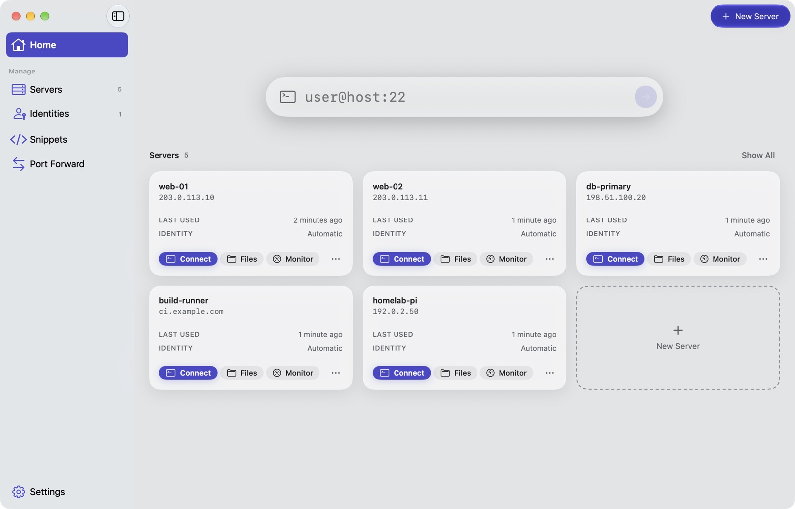
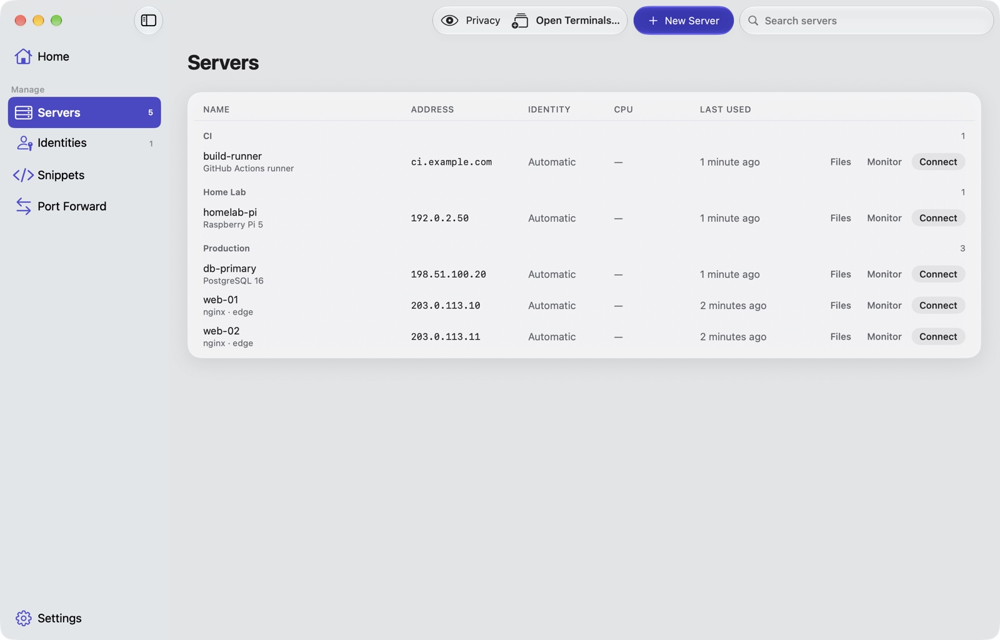
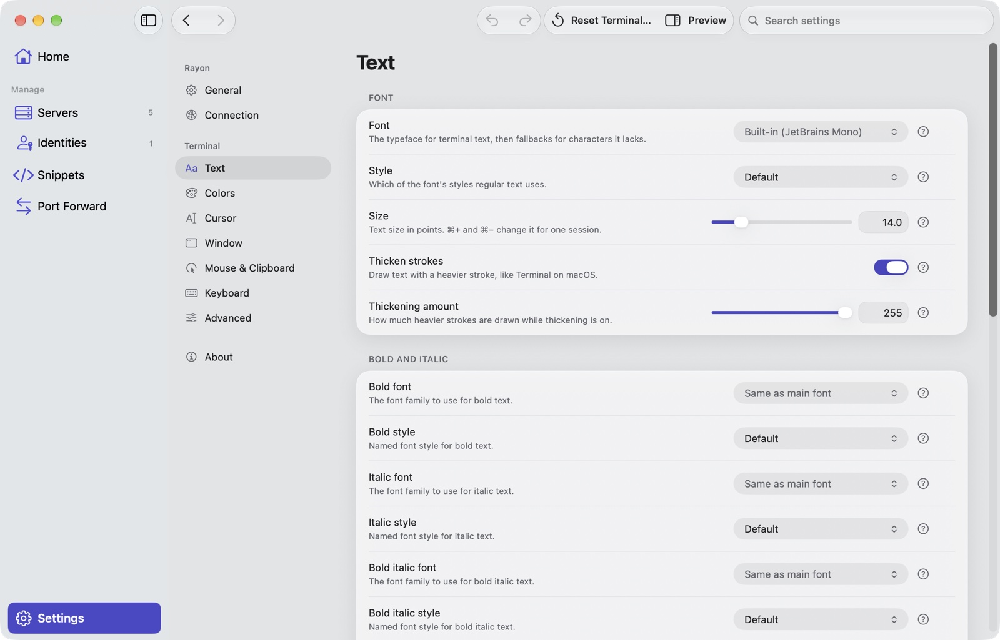
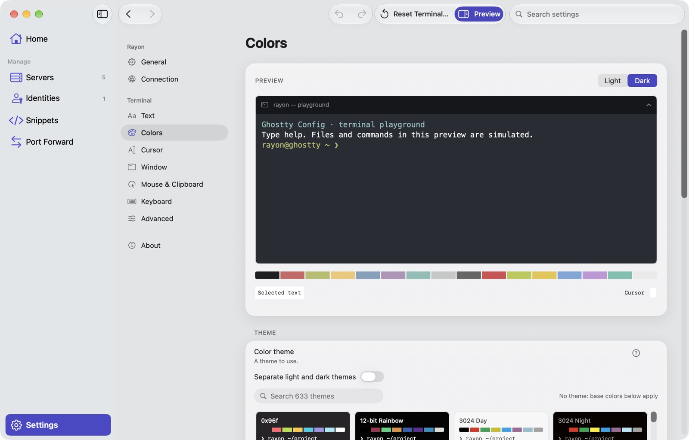
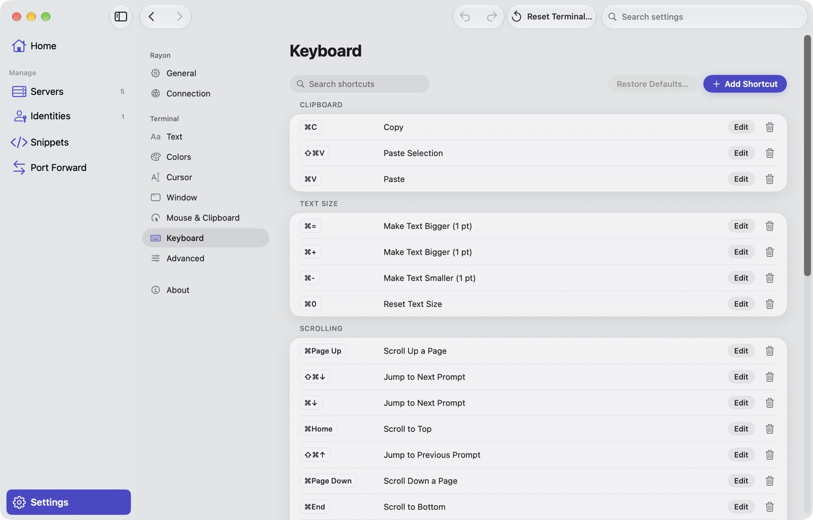

# Rayon

A native macOS app for the Linux servers you look after: an SSH terminal built on
[Ghostty](https://ghostty.org), SFTP file transfer and a live resource monitor, side
by side for every server.

[-blue)](./LICENSE)


> [!NOTE]
> This repository, [mizorewww/Rayon](https://github.com/mizorewww/Rayon), is where Rayon
> is maintained. It continues [Lakr233/Rayon](https://github.com/Lakr233/Rayon), which
> its author has archived. This version is not affiliated with or endorsed by the
> original author. The "Rayon" sold on the App Store belongs to a third party and is
> unrelated to this code.

<picture>
  <source media="(prefers-color-scheme: dark)" srcset="./Resources/Screenshots/home-dark.jpg">
  
</picture>

## Contents

- [Features](#features)
- [Screenshots](#screenshots)
- [Getting started](#getting-started)
- [Using Rayon](#using-rayon)
- [Security](#security)
- [Getting help and contributing](#getting-help-and-contributing)
- [Credits and license](#credits-and-license)

## Features

- **Terminal, Files and Monitor for every server.** One click opens each; a switcher in
  the toolbar moves between them for the same server.
- **A native Ghostty terminal** through [libghostty-spm](https://github.com/Lakr233/libghostty-spm):
  GPU rendering, 600+ bundled themes, and a translucent background that shows the
  window material behind it.
- **Visual terminal settings.** Fonts are picked from those installed on your Mac, with
  their real styles, OpenType features and variable-font axes; keyboard shortcuts are
  recorded and shown as key caps; every slider also takes a typed value.
- **Quick Connect.** Type `user@host:port` and press Return; the input is read back as
  user, host and port before you connect.
- **Server monitor** over the Linux `/proc` file system: CPU, memory, disks, network and
  NVIDIA GPUs, with no agent to install.
- **Identities** with passwords or keys, shared across servers.
- **Snippets** run on many servers at once, **port forwarding**, and a **menu bar**
  monitor with the running cat.
- **Free and open source.**

## Screenshots

| Servers | Terminal text settings |
| :---: | :---: |
| <picture><source media="(prefers-color-scheme: dark)" srcset="./Resources/Screenshots/servers-dark.jpg"></picture> | <picture><source media="(prefers-color-scheme: dark)" srcset="./Resources/Screenshots/text-dark.jpg"></picture> |
| **Colors with live preview** | **Keyboard shortcuts** |
| <picture><source media="(prefers-color-scheme: dark)" srcset="./Resources/Screenshots/colors-dark.jpg"></picture> | <picture><source media="(prefers-color-scheme: dark)" srcset="./Resources/Screenshots/keyboard-dark.jpg"></picture> |

Screenshots follow your GitHub light or dark theme. The servers shown use reserved
documentation addresses.

## Getting started

There are no prebuilt downloads yet; build Rayon from source.

### Requirements

- macOS 13 or later
- Xcode 26 or later (Swift 6.2, required by the Ghostty dependency). Command Line Tools
  alone are not enough: install Xcode and select it with `xcode-select`.

### Build and install

```sh
git clone https://github.com/mizorewww/Rayon.git
cd Rayon

# Debug build → DerivedData/Build/Products/Debug/Rayon.app
bash Workflow/Scripts/build-macos.sh

# Release build, installed to /Applications
bash Workflow/Scripts/install-macos.sh
```

Builds are universal (`arm64` and `x86_64`) and signed ad hoc for running on your own
Mac; they are not notarized. Set `DERIVED_DATA_PATH` to build elsewhere. To distribute
Rayon, configure your own team, signing identity and provisioning profile; changing
the signing identity can affect access to existing Keychain items.

You can also open `App.xcworkspace` and run the **Rayon** scheme.

## Using Rayon

1. **Add a server**: **New Server** on Home (⇧⌘N). Leave the identity on *Automatic*
   to try your identities in turn, or pick one.
2. **Connect**: click a server's tile or **Connect**. **Files** opens SFTP and
   **Monitor** opens live usage; the toolbar switcher moves between the three.
3. **Quick Connect**: type `user@host`, `user@host:2222` or a full `ssh` command on
   Home. It signs in with identities set to *Authenticate automatically*.
4. **Open several terminals** at once: **Open Terminals…** (⇧⌘T).
5. **Settings** sit in the sidebar's bottom-left corner (⌘,): General, Connection,
   then the terminal's Text, Colors, Cursor, Window, Mouse & Clipboard, Keyboard and
   Advanced. Ghostty coverage is described in
   [Foundation/RayonTerminal/CONFIGURATION.md](Foundation/RayonTerminal/CONFIGURATION.md).

### iPhone and iPad

The iOS app (`mRayon`, iOS 16+) shares the Ghostty terminal and the same Settings as
the Mac: the same categories, font picker and shortcut editor, as a list on iPhone
and iPad. Above the keyboard, the terminal shows Ghostty's key bar (esc, tab, sticky
ctrl/alt/cmd, arrows, symbols, paste). Its other screens still use the earlier
iOS design. Build it from `App.xcworkspace` with the **mRayon** scheme; UI tests
live in [Application/mRayonUITests](Application/mRayonUITests/README.md).

## Security

Rayon inherited these unresolved issues. Do not use it with credentials you cannot
afford to lose until they are fixed.

- **No host-key verification**: `NSRemoteShell.m` records the server fingerprint but
  never checks it against trusted host keys, so connections are open to
  man-in-the-middle attacks.
- **Weak credential encryption**: `Foundation/RayonModule/Sources/RayonModule/Utils/AES.swift`
  uses AES with the IV equal to the key and no authentication tag. In Debug builds the
  key is derived from the machine serial number; in Release builds a failed Keychain
  write can leave data encrypted under a non-persistent key.
- **Fragile data import**: `RayonStore.overrideImport` cannot tell missing data from a
  decryption failure and may overwrite data it cannot decrypt.

If you find a new vulnerability, please do not post exploit details in a public issue;
open an issue asking for a private contact instead.

## Getting help and contributing

- Bugs and feature requests: [open an issue](https://github.com/mizorewww/Rayon/issues).
- Pull requests are welcome. Run the terminal package tests before sending one; they
  briefly open native terminal windows and use no SSH connection or credential store:

  ```sh
  swift test --package-path Foundation/RayonTerminal          # macOS
  cd Foundation/RayonTerminal && xcodebuild test \
    -scheme RayonTerminal-Package -destination "platform=iOS Simulator,name=iPhone 17 Pro"
  ```

The app lives in `Application/Rayon` (macOS) and `Application/mRayon` (iOS); shared
code is in `Foundation/` (`RayonModule` for SSH, data and file transfer, `RayonTerminal`
for the Ghostty terminal and its settings, `RayonDesign` for the design system,
`MachineStatus` for the monitor).

## Credits and license

Rayon is maintained by [@mizorewww](https://github.com/mizorewww).

It was created by [@Lakr233](https://github.com/Lakr233) with
[@__oquery](https://twitter.com/__oquery), [@zlind0](https://github.com/zlind0),
[@unixzii](https://twitter.com/unixzii), [@82flex](https://twitter.com/82flex),
[@xnth97](https://twitter.com/xnth97), [@misakicoca](https://twitter.com/misakicoca) and
[@NyaaLyn](https://twitter.com/NyaaLyn).

The terminal is [Ghostty](https://github.com/ghostty-org/ghostty) (MIT) through
[libghostty-spm](https://github.com/Lakr233/libghostty-spm). Third-party licenses,
including libssh2 and OpenSSL, are listed in [Resources/LICENSE](./Resources/LICENSE).

Rayon is released under the [MIT License — Lakr's Edition](./LICENSE). Image assets
are not licensed for reuse.

Copyright © 2022 Lakr Aream. Copyright © 2026 mizorewww and contributors.
